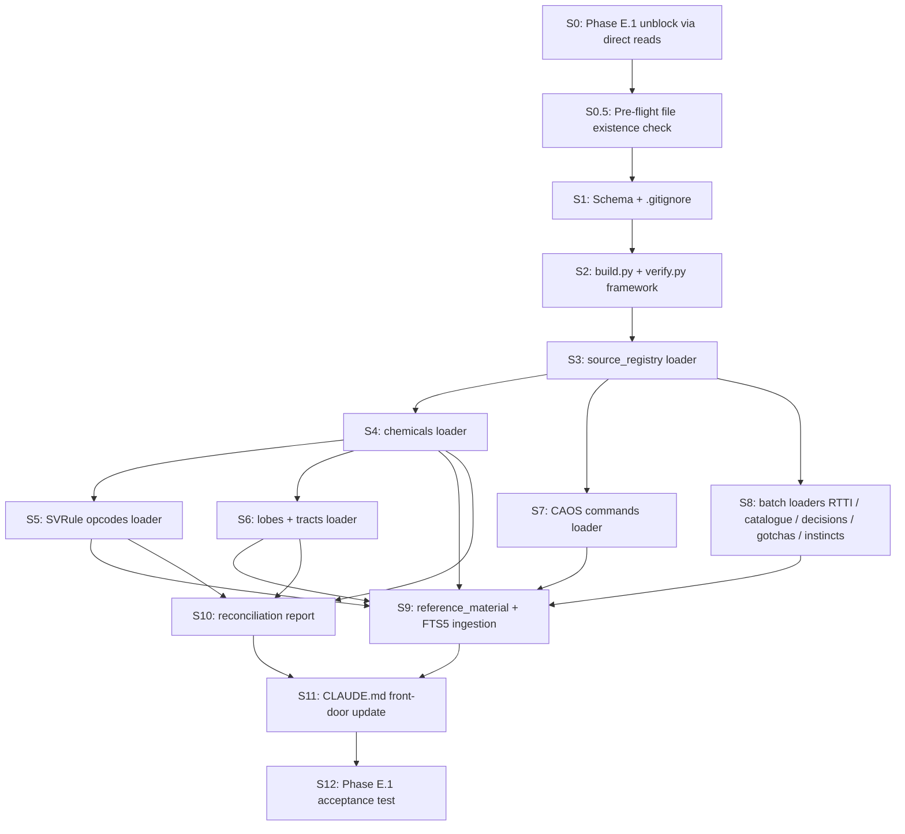

# NORNBRAIN: Central Knowledge Base ("front door")

> **Date:** 2026-04-25
> **Cynefin:** Complicated
> **Heilmeier Score:** 18/24
> **Critique Verdict:** SHIP (after revisions; see Critique Report)

> **For execution:** Use `/plan-execute` (primary). Stage 2 is parallel-friendly (5 loaders independent after Stage 1 foundation). All later waves are serial or near-serial.

## Objective

Build a queryable central knowledge base for NORNBRAIN reference data so that any small CC input (a topic, a partial name, a question fragment) reliably resolves to full context across every project knowledge surface in one round trip. Single SQLite file with FTS5 prose search. A meta-table `source_registry` registers every external store the project owns (cc-ref.yaml, peer-reviewed reference docs, the Vat Ghidra decompile, the C3 1999 source code, the 9.8 GB community archive index, NB-WIDESCRAPE-DB, the WM server). An `external_ref` table carries cross-store pointers from any KB entity row out to the relevant store entry, so multi-hop traversal is one join, not five tier-driven file loads.

The KB is reference-only. The brain never queries it at tick time. It exists to consolidate the messy, drift-prone tier-loading pattern CC currently walks every session, and to mechanise contradiction surfacing across overlapping sources (svrule-brain-complete-reference vs lisdude community archive vs Vat decompile vs C3 1999 source).

## Context

### Why now

The 2026-04-25 session shipped two large new data sources:
1. Brain in a Vat Ghidra decompilation catalogue (16 docs, 4,908 lines under `docs/reference/braininavat/`, plus 3,140 decompiled `.c` files under `analysis/braininavat/notes/decompiled/`).
2. 9.8 GB community archive (63,790 files mirrored, including the 1999 Cyberlife C3 source code at `<PROJECT_ROOT>/C3sourcecode/engine/`, plus Wayback retries, 75 GitHub repos, and Gene Loom v1.4.4 with 74 embedded opcode descriptions).

These sources surfaced concrete contradictions against the existing peer-reviewed reference doc that the current tier-loading pattern cannot reconcile mechanically:
- `MAX_NEURONS_PER_LOBE`: project doc says 1024, CL 1999 source says 65,025.
- Opcode 35 has a known backwards-formula bug embedded in Gene Loom's UI tooltips.
- decn-action ordering mismatch: project doc vs lisdude `neuron_names.txt`.

### True starting point

- No prior KB infrastructure exists; `kb/` directory absent (verified).
- `cc-ref.yaml` (230 lines, hand-curated) is the closest existing artefact and stays as authoritative input.
- Reference docs mature: `caos-dictionary.md` (801 commands), `svrule-brain-complete-reference.md` (1,134 lines, peer-reviewed with 8 corrections), `verified-reference.md` (3,666 lines), `game-files-analysis.md` (1,447 lines), `braininavat/*` (16 docs, 4,908 lines), the lisdude community archive (since archived), the lisdude cross-reference audit (since archived) (audit doc).
- C3 1999 source at `<PROJECT_ROOT>/C3sourcecode/engine/Creature/Brain/` (`SVRule.cpp+h`, `Lobe.cpp`, `Tract.cpp`, `Dendrite.cpp`, `Neuron.cpp`, `Brain.cpp`, `Instinct.cpp`, `BiochemistryConstants.h`).
- 63,790-file community archive index already exists at `.firecrawl/_INDEX/all_files.tsv`. KB references this as a `source_registry` entry; does not duplicate.
- Phase E.1 (comb contract verification) is active and blocked on cross-source verification of comb's input/output contract. The KB exists primarily to support Phase E.1 going forward, not to delay it.

### Cross-plan dependency

This plan executes alongside a parallel org-pass-hygiene plan (since archived). Two dependencies to honour:

1. **`analysis/` location is pending user decision** in org-pass Stage 3. KB Steps 5, 6, and `source_registry` entries for `vat_decompile` and `vat_catalogue` read from `analysis/braininavat/`. If org-pass moves `analysis/` to `<PROJECT_ROOT>-EXTERNAL/`, KB Step 3 and the affected loaders update their paths in the same commit. Step 0.5 pre-flight will catch this drift before Stage 1.
2. **`<PROJECT_ROOT>/.firecrawl/extended-rip-2026-04-25/` source residual** (9.4 GB, gitignored) is byte-identical to the dest. KB does not depend on it; either disposition is safe.

KB Step 0 (Phase E.1 unblock) is independent of org-pass progress and can run immediately.

### Stack assumptions

- Python 3.14 with stdlib `sqlite3` (FTS5 included). No new pip dependencies for core path.
- SQLite WAL mode, foreign keys ON, single writer, atomic swap.
- Build pipeline at `kb/build.py`. Output `kb/kb.sqlite` (gitignored, rebuildable).
- Hash-gated rebuild over `(raw_sources/** + extractors/** + schema.sql + reference/**)` content.
- Query path: Bash to `sqlite3 -json kb/kb.sqlite "..."` (no MCP layer; deferred per user direction).
- Out of scope: MCP wrapper, runtime brain reads, vector similarity, full-content indexing of 9.8 GB scrape (registered only), web_monitor `/api/kb/*` endpoints (deferred until KB stable).

## Dependency Graph



**Waves:**
- Stage 0 (must run before any KB work): S0, S0.5
- Stage 1 (serial foundation): S1, S2, S3
- Stage 2 (loaders, partial parallelism): S4 first; then S5, S6 in parallel; S7, S8 fully parallel from S3
- Stage 3 (FTS5, depends on entity tables): S9
- Stage 4 (synthesis): S10
- Stage 5 (delivery, S12 depends on S11): S11, S12

**Critical path:** S0 → S0.5 → S1 → S2 → S3 → S4 → S5 (longest single loader, three-source reconciliation) → S9 → S10 → S11 → S12. Eleven steps deep.

**Phase E.1 unblock note:** S0 resolves Phase E.1 via direct reads of three files (`SVRule.h`, `svrule-brain-complete-reference.md` comb section, the lisdude community archive (since archived) lobes section) and writes the comb input/output contract to `cc-ref.yaml comb_contract:`. This removes Phase E.1 from the KB critical path. The KB can then build at its own pace; S12 confirms the KB reproduces S0's answer with one query (regression check).

**Dual-session boundaries.** S0, S10, S11 are Extension work (planning, synthesis, governance edits). S0.5 through S9, plus S12, are CLI work (file checks, code, tests, measurements).

## Steps

### Stage 0 (precedes KB work)

#### Step 0: Phase E.1 unblock via direct reads [MODEL: sonnet] [PRIORITY: must-have] [SESSION: Extension]

**Context Brief.** Phase E.1 is currently blocked on cross-source verification of comb's input/output contract. The three contradictions cited as KB motivation (`MAX_NEURONS_PER_LOBE`, opcode 35 bug, decn-action ordering) are already known and discoverable from three files. Read those files directly, write the comb contract into `cc-ref.yaml`, unblock Phase E.1 today. The KB then builds without E.1 on its critical path. This step exists because the cumulative critique made it clear the KB build was being framed as an unblocker when the actual unblock is three file reads plus one yaml edit.

**Preconditions.** None.

**Files.**
- Modify `i:\NORNBRAIN\cc-ref.yaml` (add `comb_contract:` block)
- Modify `i:\NORNBRAIN\.planning\campaign.md` (mark Phase E.1 verification step DONE; record comb contract source citations)

**Anti-patterns.**
- Do not invent fields the three sources do not state. If `MAX_NEURONS_PER_LOBE` differs, record both with citations.
- Do not lock the architecture pivot decision in this step; that is a separate Phase E decision after the contract is written and reviewed.

**Tasks.**
- [ ] Read `<PROJECT_ROOT>/C3sourcecode/engine/Creature/Brain/SVRule.h` (full file). Capture: opcode enum, `MAX_NEURONS_PER_LOBE` constant, any reinforcement formula constants.
- [ ] Read `docs/reference/svrule-brain-complete-reference.md` comb section. Capture: input concatenation order claim, output dimensionality claim, reinforcer-to-dendrite math claim.
- [ ] Read the lisdude community archive (since archived) lobes section. Capture: comb neuron count, neuron names, structural notes.
- [ ] Synthesise into `cc-ref.yaml` under a new top-level key `comb_contract:` containing: `input_concatenation_order`, `input_dimensionality`, `output_dimensionality`, `neuron_count`, `reinforcer_to_dendrite_math`, `max_neurons_per_lobe` (with both project-doc and C3-source values), `sources` (list of file paths and lines cited per field).
- [ ] Update `.planning/campaign.md` Continuation State: mark "comb contract verified" as DONE; cite the cc-ref.yaml `comb_contract` block; advance Phase E.1 next-step list.
- [ ] Commit: `feat(phase-e): comb contract verified from three primary sources`

**Verification.**
- `grep -A 20 'comb_contract:' i:/NORNBRAIN/cc-ref.yaml` shows the new block populated.
- `grep -B 1 -A 3 'comb contract verified' i:/NORNBRAIN/.planning/campaign.md` shows the campaign update.
- Phase E.1 stops blocking subsequent Phase E work.

**Exit Criteria.** `cc-ref.yaml comb_contract:` block exists with citations from all three sources; campaign updated; Phase E.1 verification step is no longer blocking.

**Rollback.** `git checkout` cc-ref.yaml and campaign.md. Reversible.

---

#### Step 0.5: Pre-flight file existence check [MODEL: sonnet] [PRIORITY: must-have] [SESSION: CLI]

**Context Brief.** Steps 3-9 read 20+ files at specific paths (cc-ref.yaml, svrule-brain-complete-reference.md, braininavat/* docs, C3 1999 source, Vat decompile output, Gene Loom data, etc.). Several paths in the plan use phrases like "if present" or are speculative on directory layout. Two minutes of mechanical existence-checking now prevents Stage 2 abort cascades, where a missing file kills S5 or S6 mid-build and rolls back the temp DB.

**Preconditions.** None (independent of S0).

**Files.**
- Create `kb/preflight.py` (small script, no schema, no DB, just `Path.exists` plus reporting)

**Anti-patterns.**
- Do not silently proceed if a path is missing; report it and stop.
- Do not check the entire 9.8 GB scrape; check only the index file (`all_files.tsv`) plus the registered store roots.

**Tasks.**
- [ ] Implement `kb/preflight.py` listing every path the loaders need and running `Path(p).exists()` on each.
- [ ] For source_code stores, also confirm a representative file exists (e.g., `C3sourcecode/engine/Creature/Brain/SVRule.h` not just the directory).
- [ ] For binary_decompile stores, confirm `notes/decompiled/` is populated (sample a few function files).
- [ ] Output: a table with one row per source: `id`, `path`, `exists` (yes/no), `representative_file_exists` (yes/no/n.a.).
- [ ] If any required path is missing, exit 1 with a clear remediation message ("create the file at X, or remove store Y from source_registry, or update the path").

**Verification.**
- `python kb/preflight.py` exits 0 with all rows green.
- A deliberately broken path makes it exit 1 with a specific message.

**Exit Criteria.** All required source paths exist; the script is a simple, repeatable gate that the build pipeline runs before Stage 1.

**Rollback.** Delete `kb/preflight.py`. Reversible.

---

### Stage 1 (serial foundation)

#### Step 1: Schema + scaffolding [MODEL: sonnet] [PRIORITY: must-have] [SESSION: CLI]

**Context Brief.** Lay down the on-disk shape of the KB. Six tables plus one virtual FTS5 table. The schema choices are load-bearing for the rest of the build: kind enums are CHECK-constrained from day one (NORNBRAIN's kind set is small and stable, and a typo'd loader silently introducing a new variant is the failure mode the project cannot catch by inspection). Foreign keys ON. WAL mode. Atomic-swap pipeline writes a `kb.sqlite.tmp` and renames on verifier success. Rebuilds are cheap (seconds), so the file feels disposable; the team rebuilds when the schema evolves rather than running migrations. Source-of-truth design choice: every fact carries `source_registry.id` plus a free-form ref key, so attribution is mandatory at insert time.

**Preconditions.** None (first step).

**Files.**
- Create `kb/schema.sql` (the canonical SQL file, hand-edited)
- Create `kb/__init__.py` (empty package marker)
- Create `kb/.gitignore` containing `kb.sqlite`, `kb.sqlite-wal`, `kb.sqlite-shm`, `kb.sqlite.tmp`, `__pycache__/`
- Modify `.gitignore` (project root) to add `kb/kb.sqlite*` and `kb/__pycache__/`
- Create `tests/test_kb_schema.py` (pytest, runs schema against an in-memory db, asserts FK and CHECK enforcement)

**Anti-patterns.**
- Do not omit CHECK enums on `entity.kind`, `link.kind`, `external_ref.ref_kind`, `source_registry.store_kind`, `source_registry.provenance`. The project's failure mode is silent typo'd kinds, not vocabulary growth.
- Do not use `attr` bag for fields that already have first-class columns on `entity` or `chemical` or `lobe`.
- Do not put FTS5 content in the same table as structured fields. Use `content=` external-content pattern.
- Do not skip the AI/AD/AU triggers that keep `reference_material_fts` in sync with `reference_material`.
- Do not enable extensions or pragmas the stdlib `sqlite3` does not support out-of-the-box.

**Tasks.**
- [ ] Write `kb/schema.sql` with the full schema below (no abbreviation). Tables: `meta`, `source_registry`, `entity`, `attr`, `tag`, `link`, `external_ref`, `reference_material`, plus `reference_material_fts` virtual table and three sync triggers.
- [ ] Schema must include: `PRAGMA foreign_keys = ON;`, `PRAGMA journal_mode = WAL;`, all CHECK enums, `meta` keys for `schema_version`, `input_hash`, `built_at`, `source_version`.
- [ ] Write `tests/test_kb_schema.py`: open `:memory:`, exec `schema.sql`, assert FK violation rejected on bad insert, assert CHECK enum rejected on bad `entity.kind`, assert FTS5 trigger fires on insert/update/delete.
- [ ] Run `python -m pytest tests/test_kb_schema.py -v`. Assert all tests pass.
- [ ] Add `kb/kb.sqlite*` and `kb/__pycache__/` lines to root `.gitignore`. Commit.

**Schema (canonical, write to `kb/schema.sql`).**

```sql
PRAGMA foreign_keys = ON;
PRAGMA journal_mode = WAL;

CREATE TABLE meta (
  key TEXT PRIMARY KEY,
  value TEXT NOT NULL
);

CREATE TABLE source_registry (
  id            TEXT PRIMARY KEY,
  store_kind    TEXT NOT NULL CHECK (store_kind IN
                  ('yaml_authoritative','markdown_doc','sqlite','http_service',
                   'raw_archive','tsv_index','source_code','binary_decompile')),
  location      TEXT NOT NULL,
  scope         TEXT NOT NULL,
  provenance    TEXT NOT NULL CHECK (provenance IN
                  ('primary_source','decompile','reverse_engineering',
                   'peer_reviewed_doc','community_archive','cc_inference')),
  query_method  TEXT NOT NULL,
  last_indexed  TEXT,
  notes         TEXT
);

CREATE TABLE entity (
  id            TEXT PRIMARY KEY,
  kind          TEXT NOT NULL CHECK (kind IN
                  ('chemical','lobe','tract','svrule_opcode','caos_command',
                   'rtti_class','catalogue_entry','decision','gotcha',
                   'instinct_rule','agent_class','spec','plan','log',
                   'gene_type','module')),
  name          TEXT NOT NULL,
  display_name  TEXT,
  category      TEXT,
  tier          INTEGER,
  source_id     TEXT NOT NULL REFERENCES source_registry(id) ON DELETE RESTRICT,
  source_ref    TEXT NOT NULL,
  source_line   INTEGER,
  game_version  TEXT,
  ingested_at   TEXT NOT NULL
);

CREATE INDEX idx_entity_kind ON entity(kind);
CREATE INDEX idx_entity_name ON entity(name);

CREATE TABLE attr (
  id           INTEGER PRIMARY KEY AUTOINCREMENT,
  host_id      TEXT NOT NULL REFERENCES entity(id) ON DELETE CASCADE,
  key          TEXT NOT NULL,
  value_text   TEXT,
  value_num    REAL,
  source_id    TEXT NOT NULL REFERENCES source_registry(id) ON DELETE RESTRICT,
  source_ref   TEXT,
  UNIQUE (host_id, key)
);

CREATE TABLE tag (
  host_id  TEXT NOT NULL REFERENCES entity(id) ON DELETE CASCADE,
  tag      TEXT NOT NULL,
  PRIMARY KEY (host_id, tag)
);

CREATE TABLE link (
  from_id      TEXT NOT NULL REFERENCES entity(id) ON DELETE RESTRICT,
  to_id        TEXT NOT NULL REFERENCES entity(id) ON DELETE RESTRICT,
  kind         TEXT NOT NULL CHECK (kind IN
                 ('targets_chemical','targets_drive','targets_action',
                  'consumes','produces','feeds_into','reads_from',
                  'inherits_from','contains','superseded_by','supersedes',
                  'depends_on','implements','documents','implemented_in',
                  'see_also','contradicts','corroborates')),
  weight       REAL,
  source_id    TEXT NOT NULL REFERENCES source_registry(id) ON DELETE RESTRICT,
  source_ref   TEXT,
  PRIMARY KEY (from_id, to_id, kind)
);

CREATE TABLE external_ref (
  entity_id    TEXT NOT NULL REFERENCES entity(id) ON DELETE CASCADE,
  store_id     TEXT NOT NULL REFERENCES source_registry(id) ON DELETE RESTRICT,
  ref_key      TEXT NOT NULL,
  label        TEXT,
  ref_kind     TEXT NOT NULL CHECK (ref_kind IN
                 ('authoritative','corroborating','contradicting',
                  'see_also','derivation','primary_definition')),
  PRIMARY KEY (entity_id, store_id, ref_key)
);

CREATE TABLE reference_material (
  id           INTEGER PRIMARY KEY AUTOINCREMENT,
  kind         TEXT NOT NULL CHECK (kind IN
                 ('reference_doc','spec','plan','log','decision_note',
                  'validation_report','curated_note','readme')),
  entity_id    TEXT REFERENCES entity(id) ON DELETE SET NULL,
  title        TEXT,
  body         TEXT NOT NULL,
  source_id    TEXT NOT NULL REFERENCES source_registry(id) ON DELETE RESTRICT,
  source_path  TEXT NOT NULL,
  author       TEXT,
  ingested_at  TEXT NOT NULL,
  note         TEXT
);

CREATE VIRTUAL TABLE reference_material_fts USING fts5(
  title, body,
  content='reference_material', content_rowid='id',
  tokenize='porter unicode61'
);

CREATE TRIGGER rm_fts_ai AFTER INSERT ON reference_material BEGIN
  INSERT INTO reference_material_fts(rowid, title, body)
  VALUES (new.id, new.title, new.body);
END;
CREATE TRIGGER rm_fts_ad AFTER DELETE ON reference_material BEGIN
  INSERT INTO reference_material_fts(reference_material_fts, rowid, title, body)
  VALUES ('delete', old.id, old.title, old.body);
END;
CREATE TRIGGER rm_fts_au AFTER UPDATE ON reference_material BEGIN
  INSERT INTO reference_material_fts(reference_material_fts, rowid, title, body)
  VALUES ('delete', old.id, old.title, old.body);
  INSERT INTO reference_material_fts(rowid, title, body)
  VALUES (new.id, new.title, new.body);
END;
```

**Verification.**
- `python -c "import sqlite3; c = sqlite3.connect(':memory:'); c.executescript(open('kb/schema.sql').read()); print('OK')"` returns `OK`
- `python -m pytest tests/test_kb_schema.py -v` shows green for at least 4 tests: schema parses, FK enforced, CHECK enforced, FTS5 trigger fires.
- `git status` shows `kb/schema.sql`, `kb/__init__.py`, `kb/.gitignore`, `tests/test_kb_schema.py` as new, `.gitignore` modified.

**Exit Criteria.** Schema file exists at `kb/schema.sql`, instantiates cleanly into an in-memory SQLite database, all four schema tests pass.

**Rollback.** `git rm` the new files and revert `.gitignore`. No data created. Fully reversible.

---

#### Step 2: build.py + verify.py framework [MODEL: sonnet] [PRIORITY: must-have]

**Context Brief.** Wire the rebuild pipeline. `build.py` is the entry point: it computes the input hash over raw sources and loaders, compares against `meta.input_hash` of the existing `kb.sqlite`, and either skips or rebuilds. On rebuild it opens `kb.sqlite.tmp`, runs `schema.sql`, dispatches each registered loader (loaders register themselves via a small Python plugin pattern), runs the verifier, and atomically renames on success. `verify.py` exposes a `RoundTripVerifier` class that loaders use per-subsystem: each loader supplies a list of `(raw_source_path, parser)` and a list of facts produced; the verifier re-parses the raw source and asserts every fact is present in the temp db. Silent drop is a build failure, not a warning.

**Preconditions.** Step 1 complete (`kb/schema.sql` exists and tests pass).

**Files.**
- Create `kb/build.py` (CLI entry: `python -m kb.build [--force]`)
- Create `kb/verify.py` (RoundTripVerifier class + helpers)
- Create `kb/loaders/__init__.py` (loader registry: `LOADERS: list[Loader]`)
- Create `kb/loaders/base.py` (abstract `Loader` with `name`, `inputs`, `load(conn) -> LoadResult`, `verify(conn) -> VerifyResult`)
- Create `tests/test_kb_build.py` (asserts hash skip works, atomic swap works, verifier failure aborts swap)

**Anti-patterns.**
- Do not commit a build that ran in degraded mode (e.g., FK warnings ignored). Either pass or fail, no third state.
- Do not write directly to `kb.sqlite`. Always write to `kb.sqlite.tmp` and rename. The atomic swap is the only safe way to keep concurrent readers happy.
- Do not skip the input-hash check. Cache hits matter; rebuilds on every invocation defeat the cheap-rebuild assumption.
- Do not let a loader silently swallow an exception. Any loader exception aborts the build.

**Tasks.**
- [ ] Implement `kb/loaders/base.py` with `Loader` abstract base. Fields: `name: str`, `inputs: list[Path]`, methods: `load(conn) -> LoadResult` and `verify(conn) -> VerifyResult`.
- [ ] Implement `kb/build.py` main flow:
  1. Compute `input_hash = sha256(sorted file contents of all loader.inputs + schema.sql + kb/loaders/*.py)`.
  2. If `kb/kb.sqlite` exists and `meta.input_hash` matches, exit 0 with "no rebuild needed" unless `--force`.
  3. Otherwise: open `kb/kb.sqlite.tmp`, exec `schema.sql`, set `PRAGMA foreign_keys=ON`.
  4. For each loader in `LOADERS`: call `load(conn)` inside a savepoint; commit savepoint on success, rollback on exception.
  5. After all loaders: for each loader call `verify(conn)`; abort build on any verifier failure.
  6. Update `meta` keys: `schema_version`, `input_hash`, `built_at` (UTC ISO-8601), `source_version`.
  7. Close conn. `os.replace('kb/kb.sqlite.tmp', 'kb/kb.sqlite')` (atomic on Windows for same-volume).
- [ ] Implement `kb/verify.py` `RoundTripVerifier`: takes a parser callable plus a list of expected `(table, where_clause, expected_count)` tuples; returns `VerifyResult(ok: bool, missing: list[str])`.
- [ ] Implement `tests/test_kb_build.py`:
  - Test 1: build with empty `LOADERS` list produces a valid db with `meta.schema_version` set.
  - Test 2: rerun without changes; assert `mtime` of `kb.sqlite` unchanged (cache hit).
  - Test 3: `--force` rebuild produces new mtime.
  - Test 4: a loader that raises aborts the build and leaves `kb.sqlite` unchanged.
- [ ] Run `python -m pytest tests/test_kb_build.py -v`. Assert all four tests pass.

**Verification.**
- `python -m kb.build` runs cleanly with empty loader registry, produces `kb/kb.sqlite`.
- `python -c "import sqlite3; c = sqlite3.connect('kb/kb.sqlite'); print(c.execute('SELECT key, value FROM meta').fetchall())"` shows `schema_version`, `input_hash`, `built_at`, `source_version` rows.
- `python -m pytest tests/test_kb_build.py -v` green.

**Exit Criteria.** `python -m kb.build` produces a valid empty KB; rerun is a hash-skip; `--force` rebuilds; verifier-failed loader aborts the swap.

**Rollback.** `git rm` new files, `rm kb/kb.sqlite*`. Fully reversible.

---

#### Step 3: source_registry loader [MODEL: sonnet] [PRIORITY: must-have]

**Context Brief.** Register every knowledge store the project owns. This is the meta-table that makes the KB the single front door: every entity row in subsequent loaders carries a `source_id` FK into here, and `external_ref` rows point outward to here. The registrations themselves are written as a Python dict (canonical, hand-edited) inside the loader module rather than as a YAML file, because the loader is the canonical author and there is no upstream to reconcile against.

**Preconditions.** Step 2 complete (`kb/build.py` works with empty LOADERS).

**Files.**
- Create `kb/loaders/source_registry.py`
- Modify `kb/loaders/__init__.py` (append `SourceRegistryLoader` to `LOADERS`)
- Create `tests/test_kb_source_registry.py`

**Anti-patterns.**
- Do not omit any store the project actually uses. NB-WIDESCRAPE-DB and `.firecrawl/_INDEX/all_files.tsv` are easy to forget; both must be registered.
- Do not register a store with `provenance='primary_source'` unless the store genuinely is one (raw C3 source files, Vat binary). Doc reads and curated notes are `peer_reviewed_doc` or `cc_inference` respectively.
- Do not put loader-internal state into `source_registry`; this table describes external stores, not KB structure.

**Tasks.**
- [ ] Implement `SourceRegistryLoader(Loader)`. `load(conn)` issues 16 `INSERT INTO source_registry` statements covering:
  - `cc_ref` (yaml_authoritative, `cc-ref.yaml`, primary_source, Read)
  - `claude_md` (markdown_doc, `CLAUDE.md`, primary_source, Read)
  - `campaign` (markdown_doc, `.planning/campaign.md`, primary_source, Read)
  - `cc_log` (yaml_authoritative, `cc-log.yaml`, primary_source, Grep)
  - `roadmap_v2` (markdown_doc, `docs/human/roadmap-v2.md`, primary_source, Read)
  - `docs_ref_svrule` (markdown_doc, `docs/reference/svrule-brain-complete-reference.md`, peer_reviewed_doc, FTS)
  - `docs_ref_caos` (markdown_doc, `docs/reference/caos-dictionary.md`, peer_reviewed_doc, FTS)
  - `docs_ref_braininavat` (markdown_doc, `docs/reference/braininavat/`, decompile, FTS)
  - `<source_id removed: lisdude archive>` (yaml_authoritative, the lisdude community archive (since archived), community_archive, Read)
  - `<source_id removed: lisdude xref archive>` (markdown_doc, the lisdude cross-reference audit (since archived), cc_inference, Read)
  - `docs_ref_verified` (markdown_doc, `docs/reference/verified-reference.md`, peer_reviewed_doc, Read)
  - `docs_ref_game_files` (markdown_doc, `docs/reference/game-files-analysis.md`, peer_reviewed_doc, FTS)
  - `c3_1999_source` (source_code, `<PROJECT_ROOT>/C3sourcecode/engine/`, primary_source, Read+Grep) - **note:** root copy is byte-identical to the canonical inside `firecrawl-corpus/extended-rip-2026-04-25/internet-archive/creatures-3-1999-cyberlife-source-code.-7z/engine/`. Loaders may read the root copy but must NOT modify it (user directive). If the root is removed in a later org pass, switch to the canonical inside firecrawl-corpus.
  - `vat_decompile` (binary_decompile, `analysis/braininavat/notes/decompiled/`, decompile, Read+Grep)
  - `vat_catalogue` (markdown_doc, `analysis/braininavat/notes/`, decompile, Read)
  - `firecrawl_index` (tsv_index, `<PROJECT_ROOT>-EXTERNAL/firecrawl-corpus/_INDEX/all_files.tsv`, community_archive, Grep) - **note:** internal TSV path strings still reference the old `<PROJECT_ROOT>/.firecrawl/` location; record `notes='paths inside TSV are stale, regenerate or path-replace before navigation use'`
  - `firecrawl_notes` (markdown_doc, `<PROJECT_ROOT>-EXTERNAL/firecrawl/INDEX.md`, community_archive, Read) - **note:** older brain-decomp notes dir, sibling to firecrawl-corpus; do not confuse with the corpus
  - `widescrape_db` (raw_archive, `<PROJECT_ROOT>-EXTERNAL/WIDESCRAPE-DB`, community_archive, Read) - currently empty, renamed from NB-WIDESCRAPE-DB during 2026-04-25 org pass
  - `wm_server` (http_service, `http://localhost:9300`, peer_reviewed_doc, http GET)
  - `c3_install` (raw_archive, `<PROJECT_ROOT>/creaturesexodusgame/Creatures Exodus/Creatures 3`, primary_source, Read)
  - `gene_loom_v144` (raw_archive, `tools/Gene Loom v1.4.4/`, primary_source, Read)
- [ ] `verify(conn)`: assert at least 16 rows in `source_registry`; assert each registered `id` is unique; assert every `provenance` value is in the CHECK enum.
- [ ] Test 1: build runs, source_registry has expected count.
- [ ] Test 2: re-running build is idempotent (same row count, same content).
- [ ] Test 3: a deliberately invalid `provenance` raises FK/CHECK error.

**Verification.**
- `python -m kb.build --force`
- `sqlite3 -json kb/kb.sqlite "SELECT count(*) AS n FROM source_registry"` returns `[{"n": 20}]` (or whatever final count is, must be at least 16).
- `sqlite3 -json kb/kb.sqlite "SELECT id, provenance FROM source_registry ORDER BY id"` lists all stores cleanly.
- `python -m pytest tests/test_kb_source_registry.py -v` green.

**Exit Criteria.** All project knowledge stores registered; verifier passes; idempotent.

**Rollback.** Remove loader file, remove from `LOADERS`, rebuild. Reversible.

---

### Stage 2 (parallel loaders, all gated on Stage 1)

#### Step 4: chemicals loader [MODEL: sonnet] [PRIORITY: must-have]

**Context Brief.** Chemicals are the highest-frequency CC lookup in NORNBRAIN. Sources to merge: `cc-ref.yaml chemicals:` (curated subset including the canonical `reward=204`, `punishment=205`, `adrenalin=117 not 69`, `atp=35`, `adp=36`), the C3 install's `Catalogue/Chemicals.catalogue` (256 entries, full list), `BiochemistryConstants.h` (numeric constants, primary source), and Gene Loom's bundled `ChemicalNames.catalogue`. The merge resolves conflicts by precedence: C3 1999 source > C3 install catalogue > cc-ref.yaml > Gene Loom. Each chemical entity gets `external_ref` rows pointing to every source that mentions it, with `ref_kind='primary_definition'` for the highest-precedence source and `ref_kind='corroborating'` for the rest.

**Preconditions.** Step 3 complete; `source_registry` populated.

**Files.**
- Create `kb/loaders/chemicals.py`
- Modify `kb/loaders/__init__.py` (append `ChemicalsLoader`)
- Create `tests/test_kb_chemicals.py`

**Anti-patterns.**
- Do not silently coalesce conflicting names. If `cc-ref.yaml` says `adrenalin=117` and another source says `adrenalin=69`, the loader emits the C3-source-precedence answer and creates a `link kind='contradicts'` from the chemical entity to a synthetic `gotcha` row capturing the disagreement.
- Do not strip the Australian/British spellings from canonical names if that is what the primary source uses (`adrenalin`, not `adrenaline`).
- Do not attempt to interpret chemical roles (reinforcer / drive / metabolic) without source evidence; populate `attr` only when the source is explicit.

**Tasks.**
- [ ] Parse C3 install `Catalogue/Chemicals.catalogue` (256 lines, format: `TAG "Chemicals N" "name"` blocks).
- [ ] Parse `BiochemistryConstants.h` extracting `#define` values for known reinforcers and named constants.
- [ ] Parse `cc-ref.yaml chemicals:` block (already structured).
- [ ] Parse Gene Loom `ChemicalNames.catalogue` for cross-check.
- [ ] Merge: build a single `chemical_id -> {canonical_name, role?, sources: [...], conflicts: [...]}` map. Precedence as above.
- [ ] For each merged chemical: insert into `entity` with `kind='chemical'`, `id='chemical.<id>'`, `name=canonical_name`, `source_id=` highest-precedence source, `source_ref=line_or_anchor`. For role, populate `attr (host_id, key='role', value_text=...)` when known.
- [ ] For each non-precedence source mention: insert `external_ref` row.
- [ ] For each conflict: insert a `gotcha` entity (or use existing one if cc-ref.yaml gotcha already covers it) and a `link from chemical to gotcha kind='contradicts'`.
- [ ] `verify(conn)`: round-trip parse `cc-ref.yaml chemicals:` and assert every key (reward, punishment, adrenalin, atp, adp, drives_start) appears in the entity table; assert at least 250 chemical rows total; assert no orphan `external_ref` rows.
- [ ] Test: `chemical.204` exists with `name='reward'`; `chemical.117` exists with `name='adrenalin'`; `chemical.69` does NOT have `name='adrenalin'` (Geddonase per gotcha).

**Verification.**
- `python -m kb.build --force` includes `chemicals` loader output.
- `sqlite3 -json kb/kb.sqlite "SELECT id, name FROM entity WHERE kind='chemical' AND id IN ('chemical.204','chemical.205','chemical.117','chemical.69')"` returns 4 rows with expected names.
- `sqlite3 -json kb/kb.sqlite "SELECT count(*) FROM entity WHERE kind='chemical'"` returns >= 250.
- `python -m pytest tests/test_kb_chemicals.py -v` green.

**Exit Criteria.** All canonical chemicals in cc-ref.yaml are loaded; full 256-entry catalogue is present; conflicts are surfaced as `link kind='contradicts'`.

**Rollback.** Remove loader file, remove from `LOADERS`, rebuild. Reversible.

---

#### Step 5: SVRule opcodes loader [MODEL: opus] [PRIORITY: must-have]

**Context Brief.** This is the most cross-source-heavy loader and the highest-judgement step in the plan. SVRule opcodes are the primitive instructions of the C3 brain's rules engine. There are three independent sources:

1. **C3 1999 source `SVRule.h`** - primary source, enumerates opcodes by name in a `enum SVRuleOpcode` block. Authoritative numbering and naming.
2. **Vat decompile interpreter** - `FUN_00421830` in `analysis/braininavat/notes/decompiled/`, plus the dispatch table at `0x0047bbfc`. Authoritative on actual evaluation behaviour.
3. **Gene Loom v1.4.4 embedded UI tooltips** - 74 plain-English opcode descriptions, including the warning that opcode ~35 has a backwards-formula bug.

The loader merges these into one row per opcode. Mismatches between source 1 (name) and source 2 (behaviour) become `link kind='contradicts'` to a gotcha. The known opcode 35 bug becomes a tagged attr (`bug='backwards_formula'`) plus a curated note in `reference_material`. Opcode range is 0..0x44 (= 68) per the read-side clamp at `0x00424a13`.

**Preconditions.** Step 3 complete; `source_registry` includes `c3_1999_source`, `vat_decompile`, `gene_loom_v144`.

**Files.**
- Create `kb/loaders/svrule_opcodes.py`
- Modify `kb/loaders/__init__.py` (append `SVRuleOpcodesLoader`)
- Create `tests/test_kb_svrule_opcodes.py`

**Anti-patterns.**
- Do not invent opcodes that appear in only one source; flag them as `attr (key='source_only', value_text='c3_source')` so the gap is visible.
- Do not paraphrase the Gene Loom warnings into generic notes; preserve them verbatim in `reference_material.body`.
- Do not omit the dispatch-table cross-reference. The Vat dispatch table address (`0x0047bbfc`) must appear as `source_ref` on the relevant attrs.
- Do not treat the binary's opcode mnemonic absence as a fact; the binary lacks mnemonic strings (per `docs/reference/braininavat/10-svrule-engine.md`), but the C3 1999 source has them.

**Tasks.**
- [ ] Parse `<PROJECT_ROOT>/C3sourcecode/engine/Creature/Brain/SVRule.h` `enum` block. Extract `(name, value, comment_if_any)` triples.
- [ ] Parse `analysis/braininavat/notes/decompiled/00421830_FUN_00421830.c` for opcode dispatch arms; extract opcode -> behaviour-snippet map (cite line numbers).
- [ ] Read Gene Loom v1.4.4 opcode descriptions from `tools/Gene Loom v1.4.4/data/C3/opcode_descriptions.txt` if present; otherwise extract from binary strings file at `analysis/braininavat/notes/strings.txt` filtered to opcode-related entries; fall back to manual extraction from the lisdude community archive (since archived) if structured.
- [ ] For each opcode 0..68:
  - Insert `entity (kind='svrule_opcode', id='svrule_opcode.<n>', name=<C3-source-name>, source_id='c3_1999_source')`.
  - Insert `attr (host_id, key='c3_source_def', value_text=<enum line>, source_id='c3_1999_source', source_ref='SVRule.h:<line>')`.
  - Insert `attr (key='vat_dispatch_arm', value_text=<behaviour snippet>, source_id='vat_decompile', source_ref='FUN_00421830:<line>')` when present.
  - Insert `attr (key='gene_loom_description', value_text=<plain-english>, source_id='gene_loom_v144')` when present.
- [ ] For opcode 35: tag with `bug='backwards_formula'`, insert `reference_material kind='curated_note', entity_id='svrule_opcode.35', body=<verbatim Gene Loom warning>`.
- [ ] Create cross-source mismatch links: where C3-source name and Vat-decompile behaviour disagree, insert a `gotcha` entity and a `link from opcode to gotcha kind='contradicts'`.
- [ ] `verify(conn)`: assert exactly 69 (or actual count from C3 source) `svrule_opcode` rows; assert opcode 35 has `bug` tag and a `reference_material` curated note; assert every opcode has at least one `attr` row from `c3_1999_source`.
- [ ] Test: `svrule_opcode.35` exists, has `bug='backwards_formula'` tag, has a `reference_material` row mentioning "backwards".

**Verification.**
- `python -m kb.build --force` runs without verifier failure.
- `sqlite3 -json kb/kb.sqlite "SELECT count(*) FROM entity WHERE kind='svrule_opcode'"` returns count matching C3 source enum.
- `sqlite3 -json kb/kb.sqlite "SELECT t.host_id, t.tag FROM tag t WHERE t.tag LIKE 'bug%'"` includes opcode 35.
- `sqlite3 -json kb/kb.sqlite "SELECT body FROM reference_material WHERE entity_id='svrule_opcode.35'"` contains the verbatim Gene Loom warning.
- `python -m pytest tests/test_kb_svrule_opcodes.py -v` green.

**Exit Criteria.** All opcodes from C3 1999 source loaded; cross-references to Vat decompile and Gene Loom captured; opcode 35 bug surfaced as a tagged attr plus curated note.

**Rollback.** Remove loader file, remove from `LOADERS`, rebuild. Reversible.

---

#### Step 6: lobes + tracts loader [MODEL: opus] [PRIORITY: must-have]

**Context Brief.** Phase E.1 needs comb's input/output contract. This loader produces the entity rows that answer that question. Sources: `svrule-brain-complete-reference.md` (peer-reviewed, with 8 corrections noted), the lisdude community archive (since archived) (lobe/tract structured extraction), `docs/reference/braininavat/04-data-model.md` (struct layouts, sizes, vtables), `docs/reference/braininavat/11-catalogue-data.md` (lobe type tags from C3 install), and the 1999 CL source `Lobe.cpp+h` and `Tract.cpp+h`. The known contradiction `MAX_NEURONS_PER_LOBE`: project doc 1024 vs C3 source 65,025 must surface as a `gotcha` linked from the relevant lobes.

There are 13 standard C3 lobes (per Gene Loom's neuron_names.txt). Each gets one entity row plus attrs for neuron count, input source, output target, role, and (for comb) any reinforcer-pathway notes. Tracts connect lobes; each tract entity gets `link kind='feeds_into'` rows from source lobe to target lobe. The comb lobe entity must, after this loader, carry enough attrs and links that `SELECT * FROM entity WHERE id='lobe.comb'` plus joined attrs and external_refs answers Phase E.1's verification questions in one round trip.

**Preconditions.** Step 3 complete; `source_registry` includes `docs_ref_svrule`, `<source_id removed: lisdude archive>`, `docs_ref_braininavat`, `c3_1999_source`.

**Files.**
- Create `kb/loaders/lobes_tracts.py`
- Modify `kb/loaders/__init__.py` (append `LobesTractsLoader`)
- Create `tests/test_kb_lobes_tracts.py`

**Anti-patterns.**
- Do not flatten the comb-vs-decn distinction. Comb has migrating dendrites and is the "learning manifold"; decn is a thin argmax column. The loader must preserve this distinction in attrs.
- Do not treat `MAX_NEURONS_PER_LOBE=1024` as authoritative; the C3 source value is 65,025. Surface both with provenance, mark the project-doc value as a derived constraint, not a primary fact.
- Do not omit Vat data-model offsets when they exist; `BrainComponent` base class with SVRule programs at `+0x10` and `+0x128` is load-bearing detail for any future bridge implementation.

**Tasks.**
- [ ] Parse `svrule-brain-complete-reference.md` lobe section. Extract per-lobe: id, neuron count, input source description, output target, role.
- [ ] Parse `lisdude community archive.yaml lobes:` section. Extract per-lobe: id, neuron count, neuron names list.
- [ ] Parse `docs/reference/braininavat/04-data-model.md` for Lobe/Tract struct layouts. Extract sizes (Lobe `0x290`/656 bytes, Tract `0x2f0`/752 bytes).
- [ ] Parse `docs/reference/braininavat/11-catalogue-data.md` for the 12 lobe type tags (attn, decn, verb, noun, visn, smel, driv, sitn, detl, resp, prox, stim).
- [ ] Read `<PROJECT_ROOT>/C3sourcecode/engine/Creature/Brain/Lobe.h` for `MAX_NEURONS_PER_LOBE` constant.
- [ ] For each lobe (13 standard): insert `entity (kind='lobe', id='lobe.<tag>', name=<full_name>, source_id='c3_1999_source')`. Attrs: `neuron_count`, `input_source`, `output_target`, `role`, `tag` (the 4-char type tag), `struct_size_bytes=656`.
- [ ] For comb specifically: add attrs `is_learning_substrate=true`, `dendrite_dynamics='migrating'`, `replacement_target_2026_04_25=true`. External_ref to `cc-ref.yaml decisions.architecture_pivot_2026_04_25_comb`. External_ref to `docs_ref_svrule` at the comb section. External_ref to `<source_id removed: lisdude xref archive>`.
- [ ] For decn: add attrs `is_learning_substrate=false`, `dendrite_dynamics='argmax_column'`, prior pivot target.
- [ ] Insert `entity (kind='gotcha', id='gotcha.max_neurons_per_lobe', ...)` for the 1024-vs-65025 conflict. Link from each lobe entity with `kind='contradicts'`.
- [ ] Parse tracts from svrule-brain-ref + lisdude community archive. For each tract: insert `entity (kind='tract')`, plus `link from source_lobe to target_lobe kind='feeds_into' weight=NULL source_id=...`.
- [ ] `verify(conn)`: round-trip parse svrule-brain-ref lobe section; assert every lobe present; assert `lobe.comb` has `is_learning_substrate=true` attr and at least one `external_ref` to `cc_ref` for the architecture pivot decision.
- [ ] Test: `lobe.comb` returns the right attrs; `link from lobe.driv to lobe.comb kind='feeds_into'` exists if SVRule reference says so; gotcha `max_neurons_per_lobe` exists.

**Verification.**
- `python -m kb.build --force` clean.
- `sqlite3 -json kb/kb.sqlite "SELECT id, name FROM entity WHERE kind='lobe' ORDER BY id"` lists at least 13 lobes including `lobe.comb`.
- `sqlite3 -json kb/kb.sqlite "SELECT key, value_text, value_num FROM attr WHERE host_id='lobe.comb'"` shows all comb-specific attrs.
- `sqlite3 -json kb/kb.sqlite "SELECT er.store_id, er.ref_key FROM external_ref er WHERE er.entity_id='lobe.comb'"` shows pointers to the architecture pivot decision and the SVRule ref doc.
- `python -m pytest tests/test_kb_lobes_tracts.py -v` green.

**Exit Criteria.** All standard lobes loaded with cross-source attrs; comb explicitly tagged as the architecture-pivot replacement target with external_refs; MAX_NEURONS_PER_LOBE conflict surfaced as a gotcha.

**Rollback.** Remove loader file, remove from `LOADERS`, rebuild. Reversible.

---

#### Step 7: CAOS commands loader [MODEL: sonnet] [PRIORITY: should-have]

**Context Brief.** 801 CAOS commands documented in `docs/reference/caos-dictionary.md`. Each command becomes one entity. The loader is structurally simple (parse markdown table, insert rows) but high-volume. The biggest token-saving win comes from replacing "load 6,000-line CAOS dictionary" with one SQL row lookup. openc2e implementation status (working / stubbed / missing) is recorded as an attr; verified against `commandinfo.json` if present.

**Preconditions.** Step 3 complete; `source_registry` includes `docs_ref_caos`.

**Files.**
- Create `kb/loaders/caos_commands.py`
- Modify `kb/loaders/__init__.py` (append `CAOSCommandsLoader`)
- Create `tests/test_kb_caos_commands.py`

**Anti-patterns.**
- Do not load BRN: commands as `openc2e_status='working'`. Per cc-ref.yaml gotcha `openc2e_brn_commands_unimplemented`, openc2e implements zero BRN: commands.
- Do not normalise the CAOS command text; preserve original casing and argument syntax verbatim.
- Do not parse the dictionary as freeform markdown; assume table structure and fail loudly if structure shifts.

**Tasks.**
- [ ] Parse `docs/reference/caos-dictionary.md` markdown tables. Extract per-command: name, category, args, return_type, version, description.
- [ ] If `openc2e/src/openc2e/caos/commandinfo.json` exists, load it and cross-reference to populate `openc2e_status` attr.
- [ ] For each command: insert `entity (kind='caos_command', id='caos.<NAME>', name=<NAME>, source_id='docs_ref_caos')`. Attrs for category, args, return_type, version, openc2e_status.
- [ ] For BRN: family commands, ensure `openc2e_status='unimplemented'` attr is set; insert `link to gotcha.openc2e_brn_commands_unimplemented kind='see_also'`.
- [ ] `verify(conn)`: assert at least 800 entries; assert at least 9 BRN: rows tagged unimplemented.
- [ ] Test: `caos.OUTV` exists; `caos.BRN: DMPL` exists with `openc2e_status='unimplemented'`.

**Verification.**
- `python -m kb.build --force` clean.
- `sqlite3 -json kb/kb.sqlite "SELECT count(*) FROM entity WHERE kind='caos_command'"` returns >= 800.
- `sqlite3 -json kb/kb.sqlite "SELECT host_id FROM attr WHERE key='openc2e_status' AND value_text='unimplemented' AND host_id LIKE 'caos.BRN%'"` returns 9+ rows.
- `python -m pytest tests/test_kb_caos_commands.py -v` green.

**Exit Criteria.** All CAOS commands loaded; BRN: family flagged unimplemented per gotcha.

**Rollback.** Remove loader file, remove from `LOADERS`, rebuild. Reversible.

---

#### Step 8: Batch loaders (RTTI / catalogue / decisions / gotchas / instincts) [MODEL: sonnet] [PRIORITY: should-have]

**Context Brief.** Five small loaders bundled into one work package because each is independently small and they share the same input-shape pattern. RTTI classes from `braininavat/09-class-registry.md` (114 classes). Catalogue entries from `braininavat/11-catalogue-data.md` (action mappings, drive-chemical bindings, brain parameters). Decisions and gotchas straight from `cc-ref.yaml decisions:` and `cc-ref.yaml gotchas:`. Instinct rules from `openc2e/tools/instincts.py` (54 rules). Each subloader is a separate module under `kb/loaders/` but Step 8 ships them together because none individually warrants a wave slot.

**Preconditions.** Step 3 complete.

**Files.**
- Create `kb/loaders/rtti_classes.py`
- Create `kb/loaders/catalogue_entries.py`
- Create `kb/loaders/decisions_gotchas.py`
- Create `kb/loaders/instinct_rules.py`
- Modify `kb/loaders/__init__.py` (append all four loaders)
- Create `tests/test_kb_batch_loaders.py`

**Anti-patterns.**
- Do not merge `decision` and `gotcha` into one kind; they have different lifecycles (decisions get superseded; gotchas accumulate).
- Do not ingest the `instincts.py` Python source as text; parse the `INSTINCT_RULES` list at module load time using `ast.parse` so the data shape is preserved.
- Do not skip the supersession links between decisions; `architecture_pivot_2026_04_03 superseded_by architecture_pivot_2026_04_25_comb` is exactly the kind of typed traversal the KB exists for.

**Tasks.**
- [ ] RTTI loader: parse `braininavat/09-class-registry.md`, insert one `entity (kind='rtti_class', id='rtti.<class_name>')` per row, attrs for `rtti_td_address`, `vtable_address`, `size_bytes`, `inheritance_parent`. Use `link kind='inherits_from'` for parent relationships.
- [ ] Catalogue loader: parse `braininavat/11-catalogue-data.md` action mappings + brain parameters + drive-chemical bindings. Action neurons get `kind='catalogue_entry'` rows linked to `caos_command` entities where applicable; drive-chemical bindings emit `link from chemical to drive kind='targets_drive'`.
- [ ] Decisions/gotchas loader: parse `cc-ref.yaml decisions:` and `cc-ref.yaml gotchas:` blocks. Emit one entity per decision/gotcha. For decisions with `supersedes:` or `status:` containing "SUPERSEDED", emit `link kind='superseded_by'` and `link kind='supersedes'`.
- [ ] Instinct rules loader: import `openc2e/tools/instincts.py`, iterate `INSTINCT_RULES` list, insert one `entity (kind='instinct_rule', id='instinct.<n>')` per rule, attrs for trigger, target_drive, recommended_action, weight, polarity. Use `link kind='targets_chemical'` to bind to chemical entities (via drive-to-chemical lookup).
- [ ] `verify(conn)` per subloader: assert RTTI count matches doc, decisions count matches yaml, instinct count == 54.
- [ ] Test: `decision.architecture_pivot_2026_04_03` has `link kind='superseded_by' to decision.architecture_pivot_2026_04_25_comb`.

**Verification.**
- `python -m kb.build --force` clean.
- `sqlite3 -json kb/kb.sqlite "SELECT kind, count(*) FROM entity GROUP BY kind"` shows all kinds with expected counts.
- `python -m pytest tests/test_kb_batch_loaders.py -v` green.

**Exit Criteria.** All five batch loaders ship; supersession chain queryable end-to-end.

**Rollback.** Remove loader files, remove from `LOADERS`, rebuild. Reversible.

---

### Stage 3 (FTS5 ingestion)

#### Step 9: reference_material + FTS5 ingestion [MODEL: sonnet] [PRIORITY: should-have]

**Context Brief.** Index prose for full-text search. Sources to ingest: `docs/reference/*.md` (excluding the dictionary which becomes structured rows in Step 7), `docs/reference/braininavat/*.md` (16 docs), `docs/specs/*.md` (dated design specs), `docs/plans/*.md` (this plan plus historical), `docs/logs/*.md` (architectural reviews and audits). Each markdown file becomes one `reference_material` row; FTS5 triggers index `title` and `body`. Where the prose is clearly about a known entity (e.g., `docs/reference/braininavat/10-svrule-engine.md` is about SVRule opcodes), set `entity_id` to the closest match; otherwise leave NULL. Provenance is inherited from the file's registered source.

**Out of scope here:** `.firecrawl/` and `NB-WIDESCRAPE-DB`. Both are registered in `source_registry` but not full-text indexed; their provenance is unverified and indexing them would dilute the signal. They remain accessible via the all_files.tsv index for explicit grep.

**Preconditions.** Steps 4-8 complete (entity tables populated for FK resolution).

**Files.**
- Create `kb/loaders/reference_material.py`
- Modify `kb/loaders/__init__.py` (append `ReferenceMaterialLoader` last in load order)
- Create `tests/test_kb_reference_material.py`

**Anti-patterns.**
- Do not index the same file twice. Use file path as a uniqueness check.
- Do not split files mid-paragraph for FTS5; index whole files. The token cost is acceptable; the precision gain from chunking is not worth the complexity for this scale (~100 files).
- Do not index files larger than ~100KB without thinking; check sizes first and decide per-file. The svrule-brain-ref doc is 1,134 lines but a single-coherent doc; it stays whole.

**Tasks.**
- [ ] Walk `docs/reference/*.md`, `docs/reference/braininavat/*.md`, `docs/specs/*.md`, `docs/plans/*.md`, `docs/logs/*.md`.
- [ ] Per file: read body, extract title from first H1, look up `source_id` from registered prefix matching, attempt entity match by filename or title heuristic.
- [ ] Insert `reference_material (kind=<inferred from path>, entity_id=<match or NULL>, title, body, source_id, source_path, ingested_at)`. Triggers index automatically.
- [ ] `verify(conn)`: assert at least 50 `reference_material` rows; assert FTS5 search for `'comb dendrite migration'` returns rows with non-empty `snippet()`; assert no orphan rows (every row has valid `source_id`).
- [ ] Test: FTS5 search for `'opcode 35'` returns the SVRule curated note plus relevant reference docs.

**Verification.**
- `python -m kb.build --force` clean.
- `sqlite3 -json kb/kb.sqlite "SELECT count(*) FROM reference_material"` returns >= 50.
- `sqlite3 -json kb/kb.sqlite "SELECT rm.source_path, snippet(reference_material_fts,1,'**','**','...',8) FROM reference_material_fts JOIN reference_material rm ON rm.id=reference_material_fts.rowid WHERE reference_material_fts MATCH 'comb dendrite migration' LIMIT 5"` returns hits with snippets.
- `python -m pytest tests/test_kb_reference_material.py -v` green.

**Exit Criteria.** Markdown corpus indexed; FTS5 search returns hits with snippets and source attribution.

**Rollback.** Remove loader file, remove from `LOADERS`, rebuild. Reversible.

---

### Stage 4 (synthesis)

#### Step 10: Reconciliation report [MODEL: opus] [PRIORITY: should-have]

**Context Brief.** Emit a Markdown report cataloguing every cross-source contradiction the loaders surfaced, plus every source-only entity (entity present in one source but not in others where it should be). The report goes to the KB reconciliation report (since archived) for human review. It does not modify any source; reconciliation decisions stay with the human, who then either updates the authoritative source (cc-ref.yaml or the relevant reference doc) or accepts the contradiction as a permanent gotcha. This is the bootstrap reconciliation pass the user originally asked about, run mechanically against the merged KB.

**Preconditions.** Steps 4-9 complete (all loaders done).

**Files.**
- Create `kb/report.py` (the reconciliation reporter, separate from `build.py` because it does not modify the KB)
- Create `tests/test_kb_report.py`

**Anti-patterns.**
- Do not edit any cc-ref.yaml or doc/reference content from this script. Read-only synthesis.
- Do not auto-resolve contradictions. Surface them with both sides quoted and let the human decide.
- Do not confuse "source-only" (only one source has it) with "contradiction" (sources disagree). Two distinct sections.

**Tasks.**
- [ ] Implement `kb/report.py`. Query the KB for: all `link kind='contradicts'`; all entities where `external_ref` count is 1 across all sources expected to cover that kind; all decisions with `status` containing "SUPERSEDED" but no `link kind='superseded_by'`.
- [ ] Format output as Markdown: section per contradiction kind, each contradiction quotes both sides with `source_ref` and recommends a resolution (no edit performed).
- [ ] Output path: the KB reconciliation report (since archived) (or current date).
- [ ] Test: contrived contradiction inserted into a temp KB produces an entry in the report; clean KB produces "No contradictions found".

**Verification.**
- `python -m kb.report` runs and writes the report file.
- File exists, non-empty, contains at least one section header.
- `python -m pytest tests/test_kb_report.py -v` green.

**Exit Criteria.** Reconciliation report generated; reviewable by human; no source files modified.

**Rollback.** Delete the report file. Reversible.

---

### Stage 5 (delivery)

#### Step 11: CLAUDE.md front-door update [MODEL: sonnet] [PRIORITY: must-have]

**Context Brief.** Wire the KB into CC's session-loading directive. Add a Tier 0 / front-door section that tells CC: for any reference question, query `kb/kb.sqlite` first; follow `external_ref` pointers; only load full reference docs when the KB hands you a path. Existing tier ladder stays intact for cases where the KB is the wrong tool, but tiers 4 and 6 grow short notes pointing at the KB for known queries. The `corrections_law` rule extends: "fix code + cc-ref.yaml + WM memory + KB loader if reference touched in ONE commit". The `claude_md_ceiling: 300` rule applies; this update must keep the file under 300 lines (currently 195).

**Preconditions.** Step 9 complete (KB queryable end-to-end).

**Files.**
- Modify `i:\NORNBRAIN\CLAUDE.md`
- Modify `i:\NORNBRAIN\cc-ref.yaml` (extend `rules.corrections_law` rule text)

**Anti-patterns.**
- Do not delete the existing Tier 1-6 ladder. The KB augments it; the tiers remain the load path for cases where the KB does not yet cover (e.g., ad-hoc curated notes).
- Do not let CLAUDE.md exceed 300 lines. Move overflow to `cc-ref.yaml` per the existing rule.
- Do not promise CC features the KB does not yet support (e.g., do not say "fuzzy match by partial name" if no alias table exists yet; current matching is exact id or `LIKE`).

**Tasks.**
- [ ] Add a new section between "Session Context Loading" and "Tier 1": "### Tier 0 (front door): Knowledge Base". Three short paragraphs:
  1. What it is: `kb/kb.sqlite`, queryable via `sqlite3 -json`.
  2. When to use: any reference question (chemicals, lobes, opcodes, CAOS, RTTI, decisions, gotchas, prose search across reference/specs/plans/logs).
  3. The three canonical query patterns with one example each (point lookup + neighbours, recursive CTE for multi-hop, FTS5 prose search).
- [ ] Add short notes to Tier 4 and Tier 6 entries: "Prefer `kb/kb.sqlite` query for known structured lookups; load the full doc only when the KB hands you a path or when the question is freeform."
- [ ] Modify `cc-ref.yaml rules.corrections_law` text to include "+ kb loader if reference touched".
- [ ] Verify line count: `wc -l CLAUDE.md` returns < 300.

**Verification.**
- `wc -l i:/NORNBRAIN/CLAUDE.md` shows < 300 lines.
- `grep -A 5 'Tier 0' i:/NORNBRAIN/CLAUDE.md` shows the new section.
- `grep 'kb loader' i:/NORNBRAIN/cc-ref.yaml` shows the updated rule.

**Exit Criteria.** CLAUDE.md has a Tier 0 front-door section; existing tiers reference the KB where applicable; line ceiling held.

**Rollback.** `git checkout` CLAUDE.md and cc-ref.yaml. Reversible.

---

#### Step 12: Phase E.1 acceptance test [MODEL: sonnet] [PRIORITY: must-have]

**Context Brief.** Prove the KB earns its keep on the active blocker. Phase E.1 is "verify comb's input/output contract before locking architecture_pivot_2026_04_25_comb". The acceptance test is: run a single multi-hop query against `kb/kb.sqlite` that returns everything CC needs to answer that question (comb entity + its attrs + its tract neighbours + cross-source external_refs + relevant FTS5 hits + the active pivot decision). Capture token cost. Compare against the current Tier 4 + Tier 6 reading-the-doc workflow. Document both numbers in the Phase E.1 acceptance log (since archived). If KB wins on tokens AND attribution completeness, the front-door pattern is validated; if not, the gap is documented for follow-up.

**Preconditions.** Step 11 complete (CLAUDE.md updated).

**Files.**
- Create the Phase E.1 acceptance log (since archived)
- Create `tools/kb_query_phase_e1.py` (a small canned-query script the human can rerun later for regression)

**Anti-patterns.**
- Do not redefine "wins" mid-test. Define the metric before running (tokens to read raw vs tokens for sqlite3 output, plus subjective completeness rating 1-5).
- Do not invent an answer the KB cannot produce; if the KB lacks data, log it as a gap and update the relevant loader, do not paper over.
- Do not skip the comparison run. The point is the comparison.

**Tasks.**
- [ ] Define the canonical Phase E.1 question in writing: "What is comb's input concatenation order, output dimensionality, and reinforcer-to-dendrite math; and which decisions and reference docs cover the comb-as-replacement pivot?"
- [ ] Implement `tools/kb_query_phase_e1.py`: runs the multi-hop query (point lookup + attrs + tracts feeding/feeding-from + external_refs + FTS5 search for "comb"). Outputs JSON.
- [ ] Run it, capture stdout token count via `wc -c` or equivalent.
- [ ] Run the current alternative path: load `cc-ref.yaml` + `docs/reference/svrule-brain-complete-reference.md` (sections covering comb) + `docs/reference/braininavat/04-data-model.md` (Lobe layout). Token-count those reads.
- [ ] Write the acceptance log with: question, KB query path, KB output size, alternative path, alternative size, completeness rating per path, verdict (KB wins / partial / does not win).
- [ ] If verdict is "does not win", add follow-up tasks for the loader gaps to `docs/plans/2026-04-25-nb-knowledge-base.md` (this file).
- [ ] Update `.planning/campaign.md`: append a Phase E decision-log entry referencing the acceptance result.

**Verification.**
- `python tools/kb_query_phase_e1.py` runs cleanly and emits valid JSON.
- the Phase E.1 acceptance log (since archived) exists, has both paths documented with numbers.
- `.planning/campaign.md` shows the new decision-log entry.

**Exit Criteria.** Acceptance test executed and documented; verdict recorded; campaign updated.

**Rollback.** Delete the acceptance log and the query script. Revert campaign change. Reversible (the KB itself stays).

---

## Scope

**Must Have:** S0, S0.5, S1, S2, S3, S4, S5, S6, S11, S12

**Should Have:** S7, S8, S9, S10

**Could Have:**
- Web monitor `/api/kb/*` endpoints (mount KB queries on existing port 8088)
- Python query helper module (`kb/query.py`) with canned-query functions used by scripts beyond `tools/kb_query_phase_e1.py`
- Alias / fuzzy-match table for non-canonical name lookups

**Won't Have (explicitly deferred):**
- MCP wrapper (per user direction; revisit after schema is locked and queries are stereotyped)
- Runtime brain queries to the KB (KB is reference-only)
- Vector similarity / embeddings
- Full-content indexing of `.firecrawl/` (registered only) or `NB-WIDESCRAPE-DB` (registered only, provenance unconfirmed)
- Schema migration tool (rebuild from source is the migration story)
- Authoring UI / web interface (CLI + Bash queries are the API)

## Risk Register

| Risk | Source(s) | RPN (S\*O\*D) | Mitigation | Status |
|------|-----------|---------------|------------|--------|
| Phase E.1 stalls behind a 12-step build that was meant to unblock it | red team #2, skeptical PM #3 | 9\*7\*4 = 252 | Added S0: resolve E.1 via direct reads before any KB work. Removed E.1 from KB critical path. | mitigated |
| Stage 2 parallelism is illusory because S4/S5/S6/S8 share input files (cc-ref.yaml, svrule-brain-ref, lisdude community archive) | skeptical PM #1, pessimist #1 #2 | 6\*8\*5 = 240 | Resequenced S4 → (S5, S6) instead of all four in parallel. S7, S8 stay parallel from S3. | mitigated |
| Speculative file paths in S5/S6 break Stage 2 mid-build (Gene Loom data, BiochemistryConstants.h, decompiled function files) | red team #3, pessimist #4 | 8\*6\*3 = 144 | Added S0.5: pre-flight existence check before Stage 1. Stage 2 abort cascade prevented by failing fast. | mitigated |
| The "single front door" is oversold; CC still walks the tier ladder for cold-start questions and must know the schema to write queries | red team #1 | 7\*6\*4 = 168 | Step 11 framing dropped "replaces tier loading" claim. KB is documented as: (a) cross-source contradiction surfacing, (b) structured lookup when ID is known, (c) FTS prose triage when question is vague. Tier ladder remains the primary load path for cold starts until the schema is internalised. | accepted with revised framing |
| Verifier passes on row count but misses precedence-rule application (e.g., S4 chemicals: precedence rule is unverified at insert time) | prior-art #3, pessimist #1 | 7\*5\*7 = 245 | Step 2 verifier framework strengthened: every cross-source loader supplies precedence-rule assertions in addition to count assertions. S4 must verify "C3 source value present where it disagreed with cc-ref.yaml". | mitigated by S2 enhancement |
| FTS5 stale-content drift when source files are edited between rebuilds (KB and live docs desync) | prior-art #2 | 6\*8\*5 = 240 | input_hash includes mtime AND content hash of every reference doc (already specified). session wrap-up hook recommends `python -m kb.build` if any reference doc changed. Acceptance test (S12) re-runs after any reference edit. | mitigated by hash-gating |
| Schema enum lock-in on `entity.kind` and `link.kind` causes painful migration when a new kind is discovered mid-implementation | prior-art #1 | 5\*6\*6 = 180 | Schema rebuilds are seconds-cheap and the file is gitignored. Migration is "edit schema.sql, rebuild from source" not "run alembic". Acceptable cost. | accepted with rebuild posture |
| Reconciliation report (S10) generates an artefact nobody actions | prior-art #4 | 6\*7\*7 = 294 | S10 revised to include "next action per contradiction" recommendation column (update cc-ref.yaml / accept as gotcha / defer). session wrap-up workflow extended to surface unresolved contradictions count at session end. | mitigated by report format change |
| Dual-session pipeline misalignment: 12 steps span Extension/CLI handoffs but plan does not name boundaries | skeptical PM #5 | 5\*7\*5 = 175 | Header now names each step's session ([SESSION: Extension] vs [SESSION: CLI]). S0/S10/S11 are Extension; S0.5/S1-S9/S12 are CLI. Handoff notes per step where boundary is crossed. | mitigated |
| `BiochemistryConstants.h` parser fragile to compound macros and multi-line continuations | pessimist #2 | 6\*5\*5 = 150 | S4 parser scope reduced: parse `#define NAME <integer-literal>` only; record macros it cannot parse as a build warning, not a fatal error. Numeric constants are the load-bearing data; computed constants are not used in chemicals atlas. | mitigated by scope reduction |
| `external_ref` orphaning when an upstream loader re-runs selectively and an entity is deleted while a contradicts-link remains | pessimist #5 | 5\*4\*7 = 140 | Schema already has `link FROM_ID/TO_ID REFERENCES entity ON DELETE RESTRICT` which prevents this. Any selective re-run must rebuild dependent loaders or fail loud. | already mitigated by schema |

## Critique Report

### Methodology
Phase 5 dispatched 4 parallel sub-agents:
- **Pre-mortem 1** (Haiku, pessimist engineer): integration failures and underestimated complexity
- **Pre-mortem 2** (Haiku, skeptical PM): scope creep, schedule risk, dependency chain weaknesses
- **Pre-mortem 3** (Haiku, prior-art expert): patterns that historically fail in similar projects
- **Red team** (Sonnet, isolated from the three pre-mortems): adversarial review

Each produced 3-5 specific failure points or arguments against. Convergent themes (flagged by 2+ critics) were treated as near-certain problems and addressed in the plan. Divergent points were treated as known risks and entered into the register.

### Convergent themes (highest priority)

1. **Phase E.1 stalls behind KB construction.** Both red team and skeptical PM noted that the plan defers Phase E.1 verification (Step 12) to after 11 prior steps, when the three contradictions cited as KB motivation are already known and resolvable from three direct file reads. **Action: Step 0 added.** Phase E.1 unblocks before any KB code is written. The KB build is no longer on E.1's critical path.

2. **Stage 2 parallelism is illusory.** Skeptical PM and two pessimist points observed that S4/S5/S6/S8 share input files and contradiction-flagging requires cross-loader awareness. **Action: Stage 2 resequenced.** S4 (chemicals) runs first; S5 and S6 run in parallel after S4 since they reference chemical entities; S7 and S8 stay fully parallel from S3.

3. **File-existence not pre-flighted.** Red team and pessimist both noted speculative paths in S5/S6 (Gene Loom data, decompiled function files) and S3's blind registration of 20 sources. **Action: Step 0.5 added.** Pre-flight existence check runs before Stage 1 and fails loud if any required path is absent.

4. **"Single front door" oversold.** Red team correctly noted CC still needs to know the schema to construct queries; the tier ladder is not actually replaced by the KB on cold starts. **Action: Step 11 framing revised.** KB is presented as augmentation for three specific use cases (contradiction surfacing, structured lookup with known ID, FTS triage), not as a tier-ladder replacement.

5. **Verifier checks presence not correctness.** Pessimist and prior-art both flagged the verifier asserts row count, not whether the precedence rule was applied. **Action: Step 2 strengthened.** Cross-source loaders supply precedence-rule assertions to the verifier in addition to count assertions.

### Residual accepted risks

- **Schema enum lock-in.** Acceptable because rebuilds are cheap and the file is gitignored; migration is `edit schema.sql, rebuild from source`.
- **FTS5 drift between rebuilds.** Mitigated by input-hash gating but not eliminated. Acceptable for current scale (~100 reference files, single editor).
- **External_ref orphaning on selective re-runs.** Already prevented by `ON DELETE RESTRICT` in schema.

### Inversion exercise (how would I guarantee this fails?)

To guarantee failure: skip Step 0 and let E.1 stay blocked through KB construction; load every source as `provenance='primary_source'` regardless of actual provenance; omit pre-flight check; let loaders silently merge contradicting facts without `link kind='contradicts'`; index `.firecrawl/` and NB-WIDESCRAPE-DB into FTS5 to dilute search precision; skip the reconciliation report. The plan as revised avoids each of these failure modes by design.

### Verdict
**SHIP** after revisions. Step 0 plus Step 0.5 plus Stage 2 resequencing plus Step 2 verifier strengthening plus Step 11 framing revision are all applied. Convergent risks are mitigated; residual risks are documented and accepted with rebuild-from-source posture. The plan is execution-ready for `/plan-execute` with the dual-session pipeline (Extension session executes S0, S10, S11; CLI session executes S0.5 and S1-S9 and S12).

### Reversibility audit
Every step is reversible:
- S0: `git checkout cc-ref.yaml campaign.md`
- S0.5: delete `kb/preflight.py`
- S1-S10: `git rm` new files; `rm kb/kb.sqlite*`
- S11: `git checkout CLAUDE.md cc-ref.yaml`
- S12: delete acceptance log, revert campaign change

The KB itself is fully rebuildable from source; the file is gitignored, so deletion has no permanent cost. CLAUDE.md and cc-ref.yaml edits are tracked in git.

### Bottleneck
Step 5 (SVRule opcodes, three-source reconciliation) remains the longest single work package. Mitigation: Opus model assigned, S5 task list specifies precise file paths, parsing is bounded (enum file, dispatch arm extraction, plain-text descriptions), and S0.5 pre-flight catches missing input files before S5 starts. If S5 stalls, S6 (the only Stage 2 step that depends on S5 directly via opcode-aware contradiction flagging) can fall back to non-cross-referenced lobe loading; S7 and S8 are unaffected.
